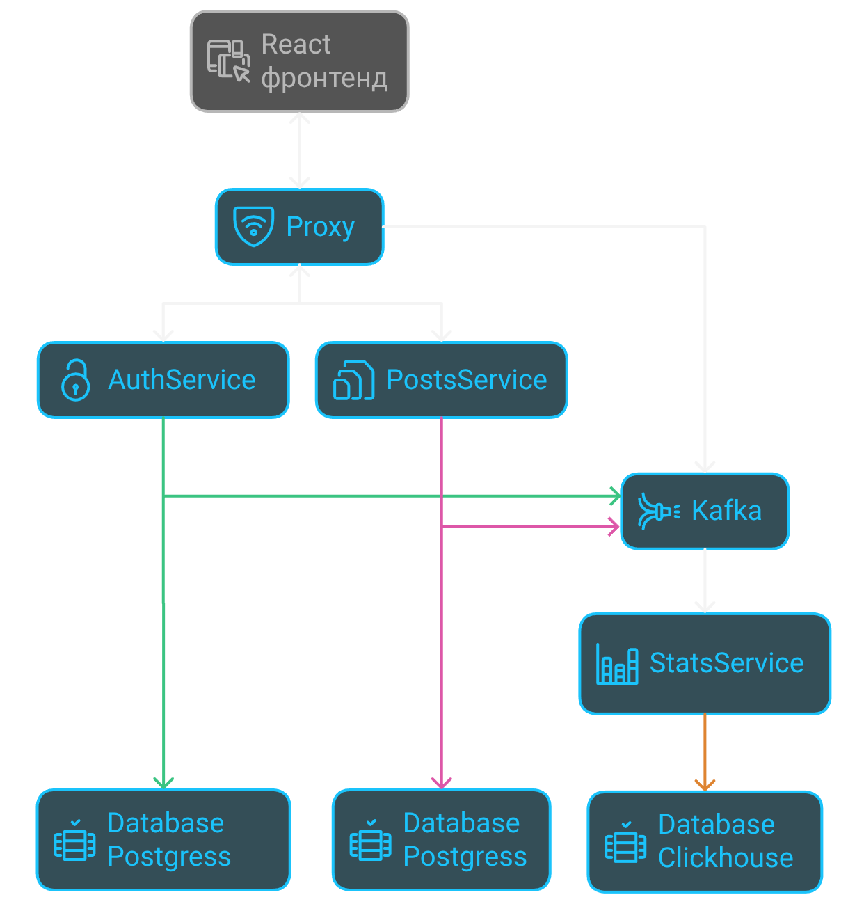

 

  <!--  -->

  <h3 align="center">SOCIAL FORUM 
      
    
    microservice system for users communications
    
  </h3>

## О проекте
Микросервисное приложение, построенное на FastAPI, с поддержкой функций аутентификации, публикации постов и комментариев, сбора статистических данных а также интеграцией с фронтендом на React. Для тестирования предусмотрена возможность генерации синтетических данных.

## Технологии

## Схема приложения

## Описание основных компонентов

### ProxyService
**Основные возможности:**
- Является API Gateway для всех микросервисов.
- Маршрутизирует HTTP-запросы пользователей к нужным сервисам (Auth, Posts, Stats).
- Реализует базовую аутентификацию: проверяет наличие и валидность токена пользователя.
- Обеспечивает единый вход для фронтенда и внешних клиентов.

### Взаимосвязи:
- Получает запросы от фронтенда/клиентов.
- Перенаправляет запросы на Auth, Posts, Stats в зависимости от типа запроса.
- Может обращаться к Kafka для логирования событий или сбора метрик.

### Auth
**Основные возможности:**
- Регистрация новых пользователей.
- Аутентификация (логин) и выдача токенов доступа.
- Валидация токенов при каждом запросе.
- Обновление профиля пользователя.
- Хранение и управление пользовательскими данными.
- Может поддерживать refresh-токены и logout.

**Взаимосвязи:**
- Получает запросы от Proxy (например, регистрация, логин).
- Проверяет токены для других сервисов (Posts, Stats) через Proxy.
- Может публиковать события в Kafka (например, "user_registered").
- Может обращаться к базе данных пользователей.

### Posts
**Основные возможности:**
-Создание, редактирование и удаление постов.
-Получение списка постов.
-Добавление и удаление комментариев к постам.
-Получение комментариев к конкретному посту.
-Может поддерживать лайки, репосты и другие действия.
-Хранение постов и комментариев.

### Взаимосвязи:
- Получает запросы от Proxy (например, создать пост, получить фид).
- Проверяет права пользователя через Proxy/Auth (например, может ли пользователь создать пост).
- Может публиковать события в Kafka (например, "post_created", "comment_added").
- Может обращаться к Stats для обновления статистики (например, количество постов).

### Stats
**Основные возможности:**
- Сбор и хранение статистики по действиям пользователей (количество постов, комментариев, лайков и т.д.).
- Предоставление агрегированных данных для фронтенда (например, топ-10 пользователей, активность по дням).
- Аналитика по использованию платформы.
- Может поддерживать экспорт данных.

**Взаимосвязи:**
- Получает события из Kafka от других сервисов (Posts, Auth).
- Отвечает на запросы Proxy (например, "показать статистику пользователя").
- Может обращаться к базе данных статистики.
- Может отправлять уведомления или отчёты другим сервисам.

